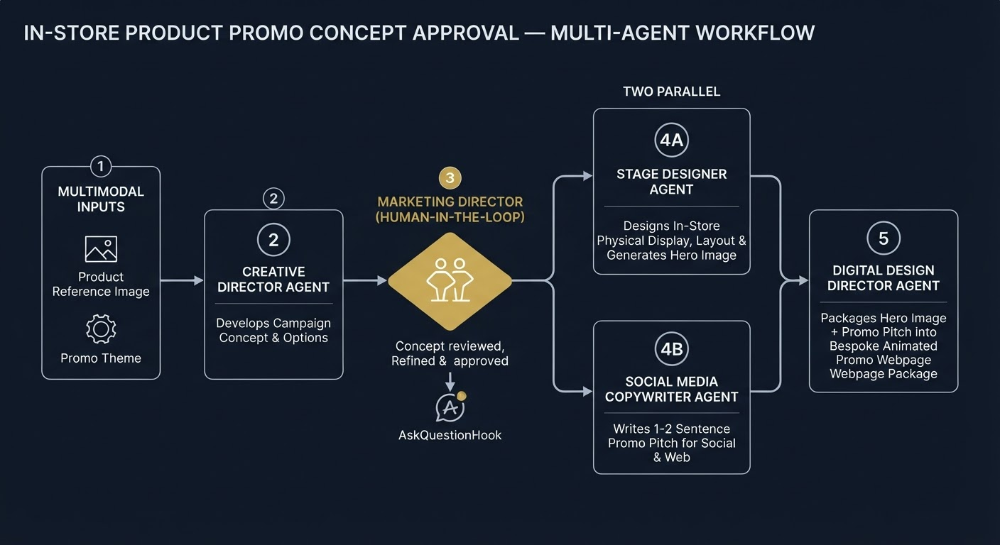
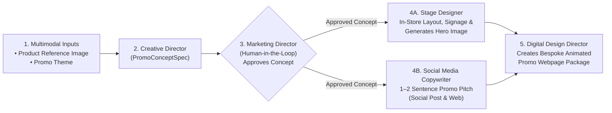
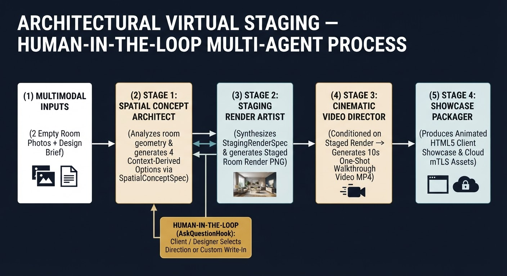

# Multimodal Agent Builder Skill

A comprehensive AI agent skill and reusable Python toolkit for architecting and implementing custom **multi-agent, multimodal pipelines with generative media assets** using the **Google Antigravity SDK** (`google-antigravity`) and **Gemini Enterprise Agent Platform**.

Unlike static, fixed-topology workflows, systems built with `multimodal-agent-builder` derive their entire **subagent team topology, structured schemas, human-in-the-loop checkpoints, and asset handoffs** directly from the specific business or creative process being automated.

---

## Key Capabilities & Core Principles

1. **Process-First Team Topology**
   - Every stage of the automated process maps to a dedicated `types.SubagentConfig` with its own persona, tools, and Pydantic schema.
   - Examples include *Architectural Virtual Staging*, *Luxury Product Reveals*, *Industrial Compliance & Safety Labeling*, and *E-Commerce Flash Drops*.

2. **Multimodal Input Ingestion (Text + Multiple Images)**
   - Ingests a primary text brief along with zero, one, or multiple reference images (site photos, CAD layouts, sketches, product shots) via `MultimodalInputBundle` and attaches them as `google.antigravity.types.Image` objects to agent turns.

3. **Real Asset Generation on Agent Platform**
   - **Image Generation**: High-resolution image synthesis via `gemini-3.1-flash-lite-image` (`location="global"`), supporting both text-to-image and reference-image-guided generation.
   - **Cinematic Video Generation**: 10-second `9:16` or `16:9` video synthesis via `gemini-omni-1.1-flash-preview` using `client.interactions.create` with image + text conditioning.
   - **Bespoke HTML5 Presentation Packaging**: From-scratch generative HTML/CSS/SVG presentations (`ProcessPresentationPackager`) following a strict 4-part hierarchy:
     1. *Impression First* (above-the-fold hero punch and key visual)
     2. *Details Go After* (narrative, specs, and embedded 9:16 video player)
     3. *Scroll-Driven Animated CSS/SVG Background*
     4. *Mobile-First (`9:16`) & Desktop Responsive Layout*
   - **Google Cloud Storage mTLS Delivery**: Uploads generated assets to GCS and produces authenticated browser URLs (`https://storage.mtls.cloud.google.com/<bucket>/<path>`).

4. **Universal Human-in-the-Loop Interaction (`ASK_QUESTION` & `ConsoleAskQuestionHook`)**
   - Human collaboration is supported at any point—for clarifying requirements, choosing between context-derived creative directions, or reviewing intermediate outputs.
   - Options presented to users are dynamically synthesized from the brief and process context (never hardcoded arrays) and **always include a custom write-in option**.
   - Supports both **Interactive Console Mode** and **Headless Autonomous Mode (`--autonomous`)** for unattended CI/CD and regression testing.

5. **Native Pydantic Structured Output (`response_schema`)**
   - All structured stage handoffs use native Antigravity SDK `LocalAgentConfig(response_schema=MyPydanticModel)` and `await response.structured_output()`, validated with `MyPydanticModel.model_validate(...)`—with zero regex fences or fallback dicts.

6. **Zero Fabricated Attributes & Brand Guideline Independence**
   - The core skill remains strictly unopinionated about brand colors, typography, or visual styles.
   - Subagents synthesize tool prompts exclusively from the user's brief, human selections, upstream specifications, and explicitly loaded domain skills—without injecting AI stock clichés.

---

## Repository Structure

```text
multimodal-agent-builder/
├── LICENSE
├── README.md
└── skills/
    └── multimodal-agent-builder/
        ├── SKILL.md                          # Complete skill instructions & architectural rules
        ├── core/                             # Reusable Python building blocks
        │   ├── __init__.py                   # Exported toolkit surface
        │   ├── asset_tools.py                # Image, video (9:16 / 16:9), and GCS mTLS upload tools
        │   ├── console_runner.py             # ConsoleAskQuestionHook & prompt_ask_question helper
        │   ├── html_packager.py              # Generative HTML5 presentation packager
        │   ├── multimodal_input.py           # MultimodalInputBundle & image normalization
        │   └── pipeline_engine.py            # Process-agnostic Stage, PipelineState, and PipelineEngine
        └── examples/                         # Reference multi-agent implementations
            ├── README.md                     # Documentation for the example pipeline
            └── architectural_virtual_staging_agent.py
```

---

## Core Toolkit Modules (`skills/multimodal-agent-builder/core/`)

| Module | Key Exports | Purpose |
| :--- | :--- | :--- |
| [`core/multimodal_input.py`](./skills/multimodal-agent-builder/core/multimodal_input.py) | `load_multimodal_inputs`, `MultimodalInputBundle`, `InputImageRecord` | Validates and loads a text prompt plus zero or more reference images (`.png`, `.jpg`, `.jpeg`, `.webp`, `.gif`) into SDK `types.Image` attachments. |
| [`core/asset_tools.py`](./skills/multimodal-agent-builder/core/asset_tools.py) | `generate_image_tool`, `generate_video_tool`, `upload_to_gcs_tool`, `get_agent_platform_client` | Connects to Gemini Enterprise Agent Platform via Application Default Credentials (ADC) to generate images, 10-second videos, and GCS mTLS artifacts. |
| [`core/console_runner.py`](./skills/multimodal-agent-builder/core/console_runner.py) | `ConsoleAskQuestionHook`, `prompt_ask_question` | Implements `hooks.OnInteractionHook` for `types.BuiltinTools.ASK_QUESTION` and provides interactive/autonomous question prompting with custom write-in support. |
| [`core/html_packager.py`](./skills/multimodal-agent-builder/core/html_packager.py) | `ProcessPresentationPackager` | Generates self-contained, scroll-animated, mobile-responsive (`9:16`) HTML5 showcase pages embedding local base64 media fallbacks and cloud mTLS links. |
| [`core/pipeline_engine.py`](./skills/multimodal-agent-builder/core/pipeline_engine.py) | `PipelineEngine`, `Stage`, `PipelineState`, `execute_structured_turn` | Orchestrates multi-stage subagent execution, enforces native Pydantic `response_schema` turns, and tracks artifacts across stages. |

---

## Prerequisites & Setup

1. **Python & `uv` Virtual Environment**
   Create and activate a virtual environment using [`uv`](https://docs.astral.sh/uv/):
   ```bash
   uv venv
   uv pip install google-antigravity google-genai pydantic google-cloud-storage
   ```

2. **Google Cloud Authentication (ADC)**
   Authenticate with Google Cloud and configure your active project:
   ```bash
   gcloud auth application-default login
   export GOOGLE_CLOUD_PROJECT="your-gcp-project-id"
   ```

---

## Process Automation Blueprint: In-Store Product Promo Concept Approval

To illustrate how `multimodal-agent-builder` derives a custom multi-agent system from a real-world business workflow—complete with **Human-in-the-Loop sign-off** and **parallel creative execution**—consider an **In-Store Product Promo Concept Approval Process**:



### Workflow Breakdown

1. **Multimodal Input (`MultimodalInputBundle`)**:
   - Accepts a **product reference image** (or multiple product/storefront photos) and a **promo theme** brief.
2. **Creative Director (`creative_director` Subagent)**:
   - Analyzes the product reference image and promo theme, and develops a structured campaign concept (`PromoConceptSpec`) along with 3–4 context-derived promotional directions.
3. **Marketing Director — Human-in-the-Loop (`ConsoleAskQuestionHook` / `ASK_QUESTION`)**:
   - The **Marketing Director (human user)** reviews the proposed concepts in the console, approves one of the Creative Director's directions, or supplies custom write-in direction before production begins.
4. **Parallel Execution Stage (`Stage Designer` + `Social Media Copywriter`)**:
   - Once the Marketing Director approves the concept, two specialized subagents run **simultaneously** (`asyncio.gather`):
     - **Stage Designer (`stage_designer`)**: Designs the creative look, feel, spatial layout, and physical presentation of products and promotional signage inside the store (`InStoreDisplaySpec`), and generates the **in-store hero image** (`generate_image_tool`) conditioned on the product reference image.
     - **Social Media Copywriter (`social_media_copywriter`)**: Crafts a punchy **1–2 sentence promotional pitch** (`PromoPitchSpec`) tailored for social media posts and the promotional landing page.
5. **Digital Design Director (`digital_design_director` Subagent)**:
   - Waits for both the **Stage Designer** (hero image) and **Social Media Copywriter** (promo pitch) to finish, then packages the approved concept, physical display hero image, and social pitch into a bespoke, scroll-animated **Promo Webpage Package** (`ProcessPresentationPackager`).



### How the Parallel + Human-in-the-Loop Stages Wire into `PipelineEngine`

```python
import asyncio
from core import (
    PipelineEngine,
    Stage,
    execute_structured_turn,
    generate_image_tool,
    prompt_ask_question,
    ProcessPresentationPackager,
)

async def run_concept_and_approval(agent, state, extra):
    # Creative Director develops concept + dynamic options from reference image & promo theme
    concept, _ = await execute_structured_turn(
        prompt=state.input_bundle.build_chat_turn_payload(state.input_bundle.prompt),
        response_schema=PromoConceptSpec,
        system_instructions=CREATIVE_DIRECTOR_INSTRUCTIONS,
    )
    # Marketing Director (Human-in-the-Loop) approves or customizes the concept
    approved = prompt_ask_question(
        question="Marketing Director Approval — Select or customize the in-store promo concept:",
        options=[f"{opt.title}: {opt.summary}" for opt in concept.options],
        allow_custom=True,
    )
    state.data["concept"] = concept.model_dump()
    state.data["approved_direction"] = approved
    return {"approved_direction": approved}

async def run_parallel_stage_and_copy(agent, state, extra):
    # Stage Designer and Social Media Copywriter execute concurrently
    async def _stage_designer_branch():
        display_spec, _ = await execute_structured_turn(
            prompt=f"Design in-store display & signage for: {state.data['approved_direction']}",
            response_schema=InStoreDisplaySpec,
            system_instructions=STAGE_DESIGNER_INSTRUCTIONS,
        )
        hero_path = generate_image_tool(
            prompt=display_spec.hero_image_prompt,
            output_path="outputs/instore_promo/hero_display.png",
            reference_image_path=[img.path for img in state.input_bundle.images],
        )
        state.set_artifact("hero_image", hero_path)
        return display_spec.model_dump()

    async def _copywriter_branch():
        pitch_spec, _ = await execute_structured_turn(
            prompt=f"Write a 1-2 sentence promo pitch for: {state.data['approved_direction']}",
            response_schema=PromoPitchSpec,
            system_instructions=SOCIAL_MEDIA_COPYWRITER_INSTRUCTIONS,
        )
        return pitch_spec.model_dump()

    display_data, pitch_data = await asyncio.gather(
        _stage_designer_branch(),
        _copywriter_branch(),
    )
    state.data["display_spec"] = display_data
    state.data["pitch_spec"] = pitch_data
    return {"display_spec": display_data, "pitch_spec": pitch_data}
```

---

## Included Runnable Example: Architectural Virtual Staging & Spatial Showcase

A complete, runnable 4-stage multi-agent implementation (`spatial_concept_architect` → Human-in-the-Loop → `staging_render_artist` → `cinematic_video_director` → `showcase_packager`) is provided in [`skills/multimodal-agent-builder/examples/`](./skills/multimodal-agent-builder/examples/README.md):



### Run Interactive Mode (With 2 Empty Room Reference Photos)
```bash
uv run python skills/multimodal-agent-builder/examples/architectural_virtual_staging_agent.py \
  --brief "Stage this vacant San Juan Islands waterfront family room in a Pacific Northwest Modern Luxury style: arrange a low-profile charcoal wool bouclé and saddle-leather L-shaped sectional facing the Cascade basalt fireplace and water views, a live-edge salvaged bigleaf maple slab coffee table on blackened steel legs, a pair of sculpted walnut and shearling lounge armchairs, a hand-knotted undyed wool area rug over the white oak floorboards, and warm blown-amber glass and blackened bronze pendant lighting" \
  --image skills/multimodal-agent-builder/examples/reference_assets/san_juan_family_room_window_view.jpg \
  --image skills/multimodal-agent-builder/examples/reference_assets/san_juan_family_room_from_patio.jpg
```

### Run in Headless Autonomous Mode (`--autonomous`)
```bash
uv run python skills/multimodal-agent-builder/examples/architectural_virtual_staging_agent.py \
  --brief "Stage this vacant San Juan Islands waterfront family room in a Pacific Northwest Modern Luxury style: arrange a low-profile charcoal wool bouclé and saddle-leather L-shaped sectional facing the Cascade basalt fireplace and water views, a live-edge salvaged bigleaf maple slab coffee table on blackened steel legs, a pair of sculpted walnut and shearling lounge armchairs, a hand-knotted undyed wool area rug over the white oak floorboards, and warm blown-amber glass and blackened bronze pendant lighting" \
  --image skills/multimodal-agent-builder/examples/reference_assets/san_juan_family_room_window_view.jpg \
  --image skills/multimodal-agent-builder/examples/reference_assets/san_juan_family_room_from_patio.jpg \
  --output-dir skills/multimodal-agent-builder/examples/outputs/san_juan_islands_family_room \
  --autonomous
```

See [`skills/multimodal-agent-builder/examples/README.md`](./skills/multimodal-agent-builder/examples/README.md) for the before/after reference photos, generated `staged_render.png`, 10-second one-shot `walkthrough_video.mp4`, and full CLI documentation.

---

## Using the Skill to Build New Agents

Point your AI coding agent to [`skills/multimodal-agent-builder/SKILL.md`](./skills/multimodal-agent-builder/SKILL.md) and provide the process you want to automate. The agent will follow the 5-step engineering workflow defined in the skill:

1. **Decompose the Process into Stages & Map Media Modalities** (static visuals -> `generate_image_tool`, kinetic/temporal experiences -> `generate_video_tool`, client delivery -> `ProcessPresentationPackager`).
2. **Define Native Pydantic Schemas & Specialized Subagents** (`pydantic.BaseModel` + `types.SubagentConfig`).
3. **Wire Stages into `PipelineEngine`** with `execute_structured_turn` and `prompt_ask_question` / `BuiltinTools.ASK_QUESTION`.
4. **Ingest Multimodal Inputs** via `load_multimodal_inputs`.
5. **Execute and Deliver** locally and/or to Google Cloud Storage with mTLS links.

---

## License

Licensed under the [Apache License 2.0](./LICENSE).
