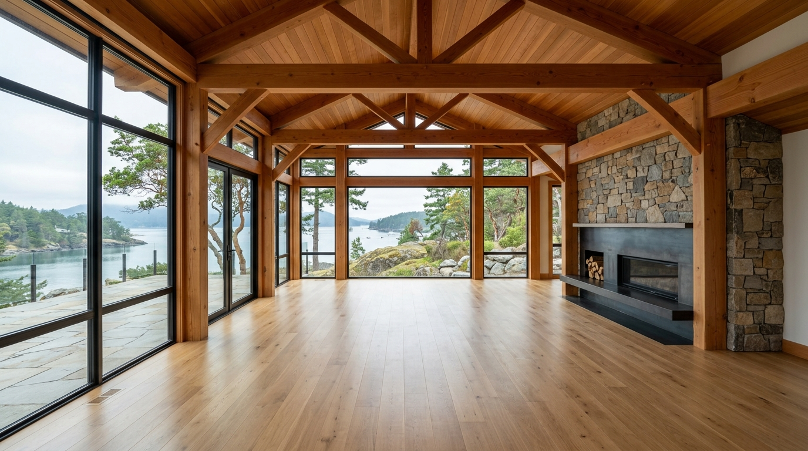
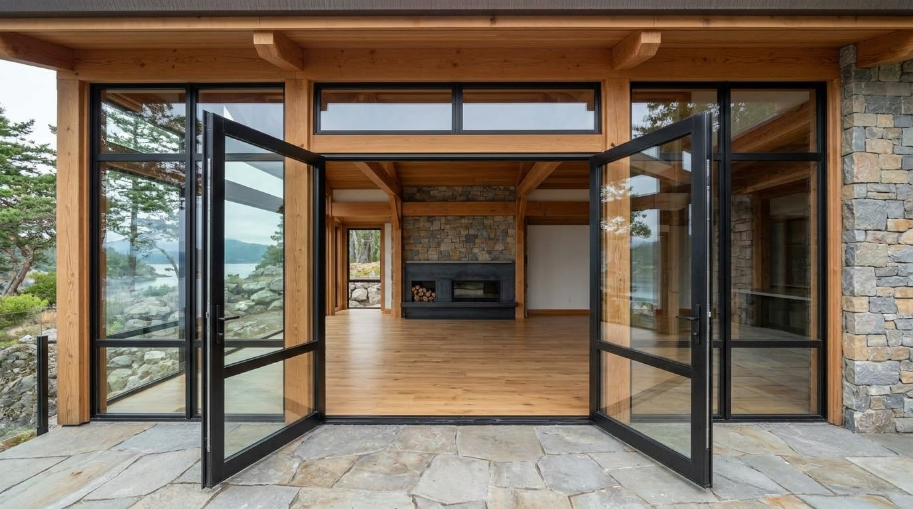
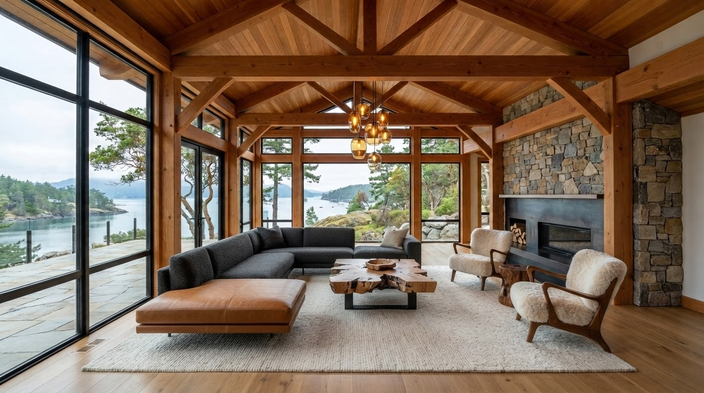

# Architectural Virtual Staging & Spatial Showcase Example

This example demonstrates how to build a complete, process-driven multimodal multi-agent pipeline using the [`multimodal-agent-builder`](../SKILL.md) skill toolkit and the Google Antigravity SDK (`google-antigravity`).

## Process-First Team Topology (More Than Prompt + Image)

Unlike a single-turn image generator that simply takes a reference photo and a prompt, [`architectural_virtual_staging_agent.py`](./architectural_virtual_staging_agent.py) orchestrates an **end-to-end architectural design process with Human-in-the-Loop governance** using the [`multimodal-agent-builder`](../SKILL.md) toolkit and the Google Antigravity SDK (`google-antigravity`).


### How the Process Unfolds

1. **Multimodal Spatial Intake**: The system ingests multiple perspectives of the empty room alongside the client's staging brief (`MultimodalInputBundle`).
2. **Context-Derived Concept Generation & Human-in-the-Loop Selection (`Stage 1`)**:
   - Before generating any pixels, `spatial_concept_architect` analyzes the structural envelope, sightlines, and circulation zones (`SpatialConceptSpec`) and proposes **3–4 distinct spatial staging directions** derived specifically from the room and brief.
   - Via `ConsoleAskQuestionHook` (`BuiltinTools.ASK_QUESTION` / `prompt_ask_question`), the **human designer or client** reviews the options and either selects one of the proposed directions or writes in a `[Custom]` spatial direction.
3. **Locked-Geometry Staged Rendering (`Stage 2`)**:
   - `staging_render_artist` translates the human-confirmed direction and room photos into a factual `StagingRenderSpec` and synthesizes the high-resolution staged photograph (`staged_render.png`).
4. **One-Shot Cinematic Walkthrough Choreography (`Stage 3`)**:
   - `cinematic_video_director` visually inspects `staged_render.png`, designs a continuous single-shot camera dolly path (`CinematicMotionSpec`), and generates a 10-second `16:9` one-shot video (`walkthrough_video.mp4`) anchored to the exact staged room.
5. **Bespoke Client Showcase Packaging (`Stage 4`)**:
   - `showcase_packager` combines the architectural narrative, `staged_render.png`, and `walkthrough_video.mp4` into a self-contained, scroll-animated HTML5 presentation (`showcase.html`) with optional Google Cloud Storage mTLS links.

| Stage | Subagent (`types.SubagentConfig`) | Pydantic Schema (`response_schema`) | Responsibility & Output Artifacts |
| :--- | :--- | :--- | :--- |
| **1. `concept`** | `spatial_concept_architect` | `SpatialConceptSpec` | Analyzes the text brief and reference room photos (`MultimodalInputBundle`), formulates spatial zones and material notes, generates 3–4 context-derived staging directions, and collaborates with the human reviewer (`prompt_ask_question` + `BuiltinTools.ASK_QUESTION`) to lock in a direction or custom write-in. |
| **2. `visual_production`** | `staging_render_artist` | `StagingRenderSpec` | Synthesizes a factual image generation prompt strictly from the user's brief and confirmed direction, generates `staged_render.png` via `generate_image_tool` (`gemini-3.1-flash-lite-image`), and optionally uploads to GCS (`upload_to_gcs_tool`). |
| **3. `video_production`** | `cinematic_video_director` | `CinematicMotionSpec` | Inspects `staged_render.png`, designs a single-shot 10-second camera dolly movement (`CinematicMotionSpec`), and generates `walkthrough_video.mp4` via `generate_video_tool` (`gemini-omni-1.1-flash-preview`). |
| **4. `presentation_packaging`** | `showcase_packager` | `ShowcasePresentationSpec` | Generates presentation copy and packages `staged_render.png`, `walkthrough_video.mp4`, and `pipeline_metadata.json` into a bespoke, scroll-animated, mobile-first HTML5 showcase (`showcase.html`) via `ProcessPresentationPackager`. |

## Running the Example

Ensure you have configured Application Default Credentials (`gcloud auth application-default login`) and set `GOOGLE_CLOUD_PROJECT`.

### 1. Multimodal Input Mode (San Juan Islands PNW Modern Luxury Family Room)
Two architectural reference photographs of the same empty San Juan Islands house family room are included in [`reference_assets/`](./reference_assets):
- [`reference_assets/san_juan_family_room_window_view.jpg`](./reference_assets/san_juan_family_room_window_view.jpg) — Interior wide view looking toward the floor-to-ceiling steel windows overlooking the San Juan Islands shoreline, Douglas fir trusses, and the right-side stone fireplace.
- [`reference_assets/san_juan_family_room_from_patio.jpg`](./reference_assets/san_juan_family_room_from_patio.jpg) — Second angle taken from the stone flagstone patio outside, looking straight inward through the open black-steel French doors across the empty oak floor toward the stone fireplace.

| Input Photo 1 (Interior Window View) | Input Photo 2 (From Outside Patio Looking In) |
| :---: | :---: |
|  |  |

Run interactively in the terminal (default mode without `--autonomous`):
- **Dynamic Option Selection**: `spatial_concept_architect` derives 3–4 staging options from the brief and room photos (`prompt_ask_question`) and lets you pick an option or enter a `[Custom]` direction.
- **Deterministic Approval Gates & Iterative Rollback (`requires_approval=True`)**: After Stages 1 (`concept`), 2 (`visual_production`), and 3 (`video_production`), `prompt_approval_gate` enforces a strict deterministic approval check (`GateDecision.approved == True`).
  - **Only Option `[1]` (`Approve` / `yes`)** advances the pipeline to the next stage.
  - **Any other response (`[2] Deny`, `[3] Custom`, or any freeform instructions)** blocks forward progression and invokes `resolve_rollback_stage` (`StageRoutingDecision`), which analyzes your feedback and rewinds the pipeline to the appropriate earlier (or current) stage (`concept`, `visual_production`, or `video_production`) with your `revision_instructions` injected into that stage's `extra` parameter.

```bash
uv run python skills/multimodal-agent-builder/examples/architectural_virtual_staging_agent.py \
  --brief "Stage this vacant San Juan Islands waterfront family room in a Pacific Northwest Modern Luxury style: arrange a low-profile charcoal wool bouclé and cognac saddle-leather L-shaped sectional facing the stacked stone fireplace and island water views, a live-edge salvaged bigleaf maple slab coffee table on blackened steel legs, a pair of sculpted walnut and shearling lounge armchairs on a hand-knotted undyed wool area rug over the wide-plank white oak floor, and warm blown-amber glass and blackened bronze pendant lighting suspended from the Douglas fir trusses" \
  --image skills/multimodal-agent-builder/examples/reference_assets/san_juan_family_room_window_view.jpg \
  --image skills/multimodal-agent-builder/examples/reference_assets/san_juan_family_room_from_patio.jpg \
  --output-dir skills/multimodal-agent-builder/examples/outputs/san_juan_islands_family_room_interactive
```



<video controls width="100%">
  <source src="./outputs/san_juan_islands_family_room_interactive/walkthrough_video.mp4" type="video/mp4">
</video>

### 2. Headless / Autonomous Mode (`--autonomous`)
Automatically resolves agent questions using the default context-derived option without blocking (and persists stage checkpoints to `pipeline_checkpoint.json`):

```bash
uv run python skills/multimodal-agent-builder/examples/architectural_virtual_staging_agent.py \
  --brief "Stage this vacant San Juan Islands waterfront family room in a Pacific Northwest Modern Luxury style: arrange a low-profile charcoal wool bouclé and cognac saddle-leather L-shaped sectional facing the stacked stone fireplace and island water views, a live-edge salvaged bigleaf maple slab coffee table on blackened steel legs, a pair of sculpted walnut and shearling lounge armchairs on a hand-knotted undyed wool area rug over the wide-plank white oak floor, and warm blown-amber glass and blackened bronze pendant lighting suspended from the Douglas fir trusses" \
  --image skills/multimodal-agent-builder/examples/reference_assets/san_juan_family_room_window_view.jpg \
  --image skills/multimodal-agent-builder/examples/reference_assets/san_juan_family_room_from_patio.jpg \
  --output-dir skills/multimodal-agent-builder/examples/outputs/san_juan_islands_family_room \
  --autonomous
```

### 3. With Google Cloud Storage mTLS Delivery (`--bucket`)
Automatically uploads all intermediate and final artifacts to GCS and embeds authenticated `https://storage.mtls.cloud.google.com/...` links in the showcase footer:

```bash
uv run python skills/multimodal-agent-builder/examples/architectural_virtual_staging_agent.py \
  --brief "Stage this vacant San Juan Islands waterfront family room in a Pacific Northwest Modern Luxury style" \
  --image skills/multimodal-agent-builder/examples/reference_assets/san_juan_family_room_window_view.jpg \
  --image skills/multimodal-agent-builder/examples/reference_assets/san_juan_family_room_from_patio.jpg \
  --bucket my-gcs-showcase-bucket \
  --gcs-prefix showcases/san-juan-family-room
```
